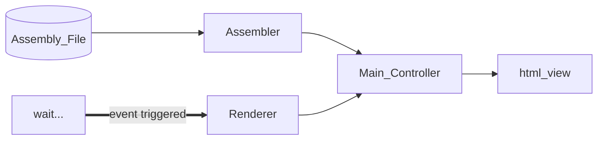
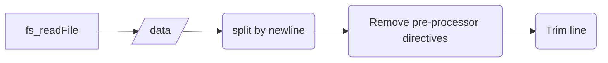
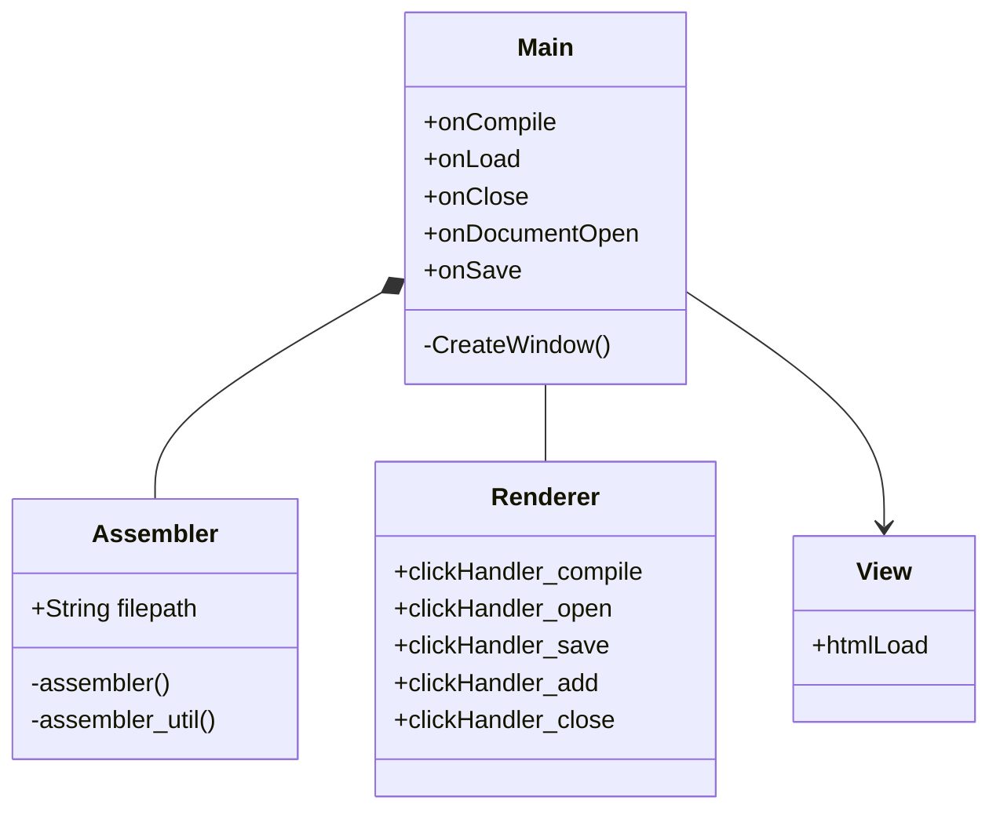

# Assemblee TRACS Assembler Software Design Document

Authors: *Jhury Kevin Lastre  |  Paul John Toral  

<aside>
💡 This document explains how the TRACS Assembler software translates assembly language into machine code for the TRACS architecture. It covers the assembler's goals, architecture, data input, and interface design. The assembler uses Electron.js and Node.js and has a client-server architecture with a Model-View-Controller pattern.

</aside>

[https://github.com/pjtoral/TRACS_Assembler](https://github.com/pjtoral/TRACS_Assembler)

## Introduction

This document outlines the design of the TRACS Assembler software. The assembler is responsible for translating assembly language into machine code, allowing for the execution of programs on the TRACS architecture. This document will detail the various components of the assembler and their interactions, as well as provide an overview of the design decisions made during its development.


## Design Goals and Objectives

The following are the goals and objectives that the TRACS assembler aims to achieve.

- Create an assembler that translates the TRACS Architecture assembly code into hex codes that will be passed into the address register and bus.
- Output a text (*.txt*) file for the translated assembly code.
    
    `ADDR=<address>; BUS=<instruction high byte>; MainMemory();`
    
    `ADDR=<address+1>; BUS=<instruction low byte>; MainMemory();`
    
- Create a desktop application text editor for users to have a visual interface on uploading their *.asm* file, editing their assembly code, and reviewing the output before exporting it into a text file.
- Use modern desktop application technologies in the development of the software. Make sure that the assembler GUI and source code runs on different operating systems.

## Architecture and System Design

The architecture used in the system is a client-server architecture with a Model-View-Controller (MVC) pattern. In this scenario, the model is uploaded to the server which triggers the assembler function to generate an output. The client requests this output through an event like a button click to which the server would send the response back to the client to be displayed.




### Tools Used

**[Electron.js](https://www.electronjs.org/)** - The frontend was built using Electron.js, which allows for the development of a cross-platform desktop application using web technologies such as HTML, CSS, and JavaScript. The frontend application will provide a graphical user interface for the user to interact with the system.

**[Node.js](https://nodejs.org/en)** - The backend was built using Node which is a popular runtime environment for building scalable and efficient server-side applications. The server will handle the communication with the frontend and perform the assembler compilation process on the uploaded input files.

**Assembler** - The assembler is a standalone program or a library that is integrated into the Node.js server. It will take the input files and generate the desired output based on the assembler settings configured by the user.

```json
package.json
{
    "name": "assemblee",
    "version": "1.0.0",
    "main": "main.js",
    "devDependencies": {
        "electron": "^24.0.0"
    },
    "scripts": {
        "start": "electron ."
    },
    "dependencies": {
        "codemirror": "^6.0.1",
        "highlight.js": "^11.7.0",
        "mz": "^2.7.0"
    }
}
```

## Data Input

The assembly code to be inputted is based on the TRACS Assembly architecture. The architecture recognizes the following instructions

| Operation | Instruction Code |
| --- | --- |
| ADD | 11110 |
| SUB | 11101 |
| MUL | 11011 |
| AND | 11010 |
| OR | 11001 |
| NOT | 11000 |
| XOR | 10111 |
| SHL | 10110 |
| SHR | 10101 |
| WM | 00001 |
| RM | 00010 |
| RIO | 00100 |
| WIO | 00101 |
| WB | 00110 |
| WIB | 00111 |
| WACC | 01001 |
| RACC | 01011 |
| SWAP | 01110 |
| BR | 00011 |
| BRE | 10100 |
| BRNE | 10011 |
| BRGT | 10010 |
| BRLT | 10001 |
| EOP | 11111 |

Data is opened using a modernized ([mz - npm (npmjs.com)](https://www.npmjs.com/package/mz)) `fs.readFile` function. Each line is split by the newline character, and pre-processor directives (comments) are removed per line using regex. Whitespaces are then trimmed from each line to avoid character sensitive errors.




## Interface Design

This section defines the user interfaces and interactions between different software components.




- Main Component - This component handles the scaffolding of the entire application from displaying it on the screen to closing it. Business logic is contained within the main component.
- Renderer - The renderer is responsible for listening to button click events. Depending on which button is clicked, it communicates with the Main component to execute the specific function for a certain button.
- Assembler - The assembler is a stand alone function/dependency required to output the compiled assembly input on the application. It is composed inside the Main Component.
- View - is an HTML file with a corresponding CSS file. This component is responsible for handling the layout, semantics, and displaying the content on the application.

## References:

TRACS Document | University of San Carlos - Department of Computer Engineering

[Build cross-platform desktop apps with JavaScript, HTML, and CSS | Electron (electronjs.org)](https://www.electronjs.org/)

[Node.js (nodejs.org)](https://nodejs.org/en)

[User Journey Diagram | Mermaid](https://mermaid.js.org/syntax/userJourney.html)

[mz - npm (npmjs.com)](https://www.npmjs.com/package/mz)
